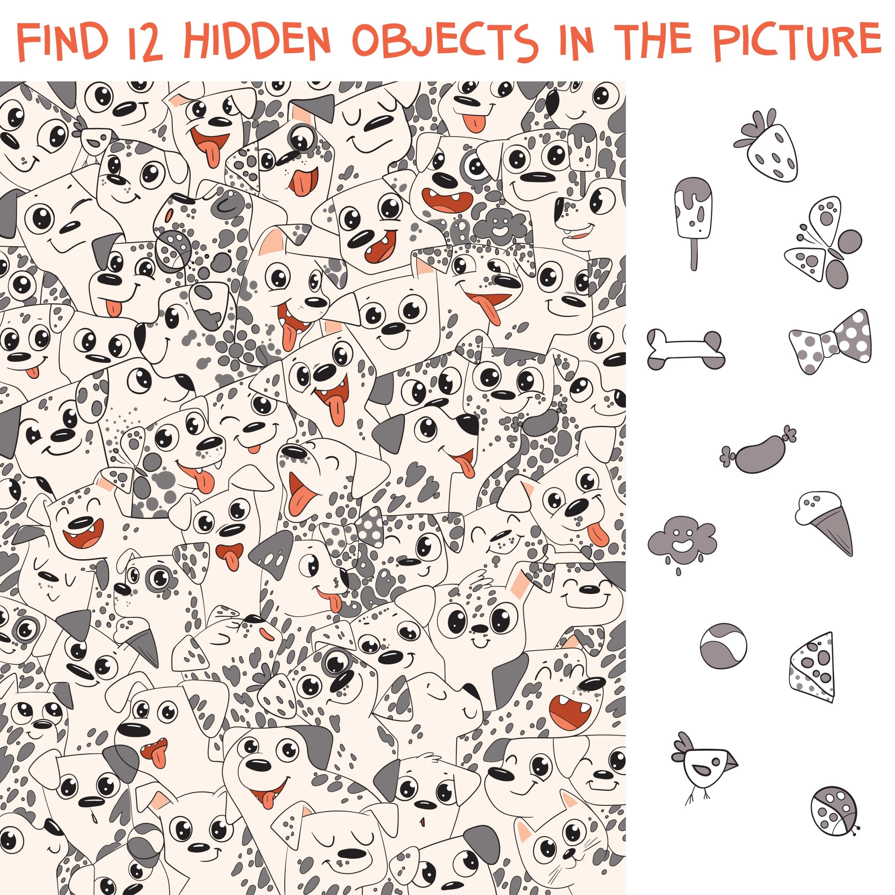

# 🖼️ Multi-Scale Template Matching với Canny Edges

Repo này trình bày phương pháp **Multi-Scale Template Matching** kết hợp với **Canny Edge Detection** trong xử lý ảnh bằng thư viện OpenCV. Mục tiêu là xác định chính xác vị trí xuất hiện của một mẫu (template) trong ảnh gốc, bất kể sự thay đổi về kích thước.

# 📘 Bài toán
Ảnh gốc chứa các đối tượng có thể có kích thước khác nhau, và mục tiêu là xác định vị trí xuất hiện của một template (mẫu) nhỏ trong ảnh này.

# ✅ Kết quả
Kết quả sau khi áp dụng phương pháp là một ảnh được đánh dấu vị trí xuất hiện của template bằng hình chữ nhật. Phương pháp này hoạt động hiệu quả ngay cả khi template nhỏ hơn hoặc lớn hơn so với bản gốc.

